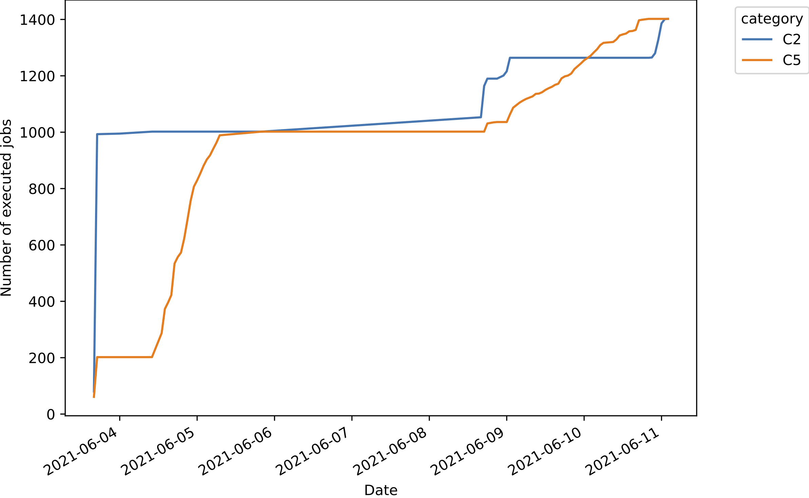
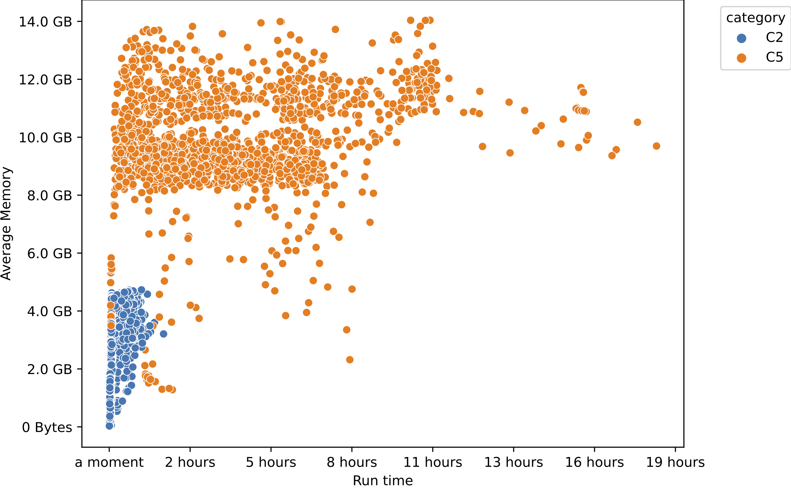

# lsf_stats

[](https://pypi.python.org/pypi/lsf_stats)
[](https://github.com/kpj/lsf_stats/actions)

Summarize [LSF](https://www.ibm.com/support/pages/what-lsf-cluster) job properties by parsing log files of workflows executed by [Snakemake](https://github.com/snakemake/snakemake/).


## Installation

```python
$ pip install lsf_stats
```


## Usage

```bash
$ lsf_stats --help
Usage: lsf_stats [OPTIONS] COMMAND [ARGS]...

  Summarize LSF job properties by parsing log files.

Options:
  --version  Show the version and exit.
  --help     Show this message and exit.

Commands:
  gather     Aggregate information from log files in single dataframe.
  summarize  Summarize and visualize aggregated information.
```

### Example

Assume that you executed your Snakemake workflow using the [lsf-profile](https://github.com/Snakemake-Profiles/lsf) and all generated log files are stored in the directory `./logs/`:
```bash
$ snakemake --profile lsf
[..]
```

You can then quickly aggregate resource, rule and other types of information about the workflow execution into a single dataframe:
```bash
$ lsf_stats gather -o workflow_stats.csv.gz ./logs/
[..]
```

This dataframe can then be summarized in various ways:
```bash
$ lsf_stats summarize \
    --query 'status == "Successfully completed."' \
    --split-wildcards \
    --grouping-variable category \
    workflow_stats.csv.gz
[..]
```

For example, the following plots will be generated:
Job execution                                 |  Job resources
:--------------------------------------------:|:----------------------------------------:
 | 
